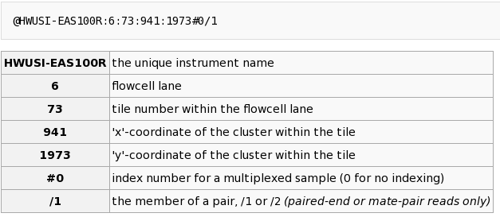

## Curso de Iniciación a la Secuenciación Masiva
BU-ISCIII

### Práctica : Formato fastq

#### Descripción
En esta parte de la práctica vamos a abrir ficheros fastq de prueba, uno obtenido con HiSeq, otro con MiSeq y un fichero de formato sff de 454.

Objetivos:

* Visualizar e interpretar cabeceras del formato fastq.
* Contabilizar número de reads en fichero fastq.
* Conversión de formato fastq a formato fasta.
* Visualización de formato sff de 454.
* Conversión de sff a fastq.

Los datos para esta parte se encuentran en la carpeta con nombre `02_handson_preprocessing`.

#### Formato fastq obtenido de HiSeq y MiSeq
Abrimos una terminal, vamos a crear nuestra carpeta de trabajo y a copiar los datos de la práctica que vamos a realizar hoy.
```bash
# Comprobamos donde estamos
pwd
## /home/alumno. 
# Sino nos encontramos aquí podemos hacer directamente
cd
# Volvemos a comprobar donde estamos
pwd

# Creamos una carpeta donde trabajaremos todos los siguientes días del curso
mkdir ngs_course_exercises
# Comprobamos que se ha creado la carpeta
ls

# Entramos en la carpeta
cd ngs_course_exercises

# Copiamos la práctica de hoy
cp /mnt/ngs_course_shared/02_handson_preprocessing .
```

Listamos el contenido de este directorio y vamos a ver una serie de carpetas con distintos ejemplos de ficheros crudos obtenidos de experimentos de secuenciación masiva. Concretamente encontramos tres directorios con datos de HiSeq, MiSeq y 454.

```bash
# Comprobamos donde estamos
pwd

# Nos movemos a la carpeta de la práctica
cd 02_handson_preprocessing
cd 01_fastq_format

# Listamos su contenido
ls
```

Vamos a la carpeta de hiseq y vemos que contiene dos ficheros con extensión fastq. Se corresponden con un experimento de secuenciación paired-end de Illumina con HiSeq 2000. El fichero R1 va a contener los reads forward y el fichero R2 va a contener
los reads en reverse.
>**Nota**: El comando zcat tiene el funcionamiento igual que cat, pero se usa para archivos comprimidos (extensión ".gz"); zcat descomprime y  muestra el contenido descomprimido por pantalla.

```bash
# Nos movemos a la carpeta prueba_hiseq
cd prueba_hiseq

# Listamos lo que hay en el directorio
ls
# Output: prueba_hiseq_R1.fastq.gz prueba_hiseq_R2.fastq.gz

# Activamos el environment de conda
conda activate ngs_course

# Visualizamos los ficheros fastq
zcat prueba_hiseq_R1.fastq.gz | less
zcat prueba_hiseq_R2.fastq.gz | less
# Recordatorio: Para salir del comando less utilizamos q
```

En pantalla observaremos algo como muestra la imagen. Este es el formato de un fichero fastq como se vio en la parte de teoría. Cada lectura son 4 líneas:

1) Cabecera: comienza siempre por @


2) Secuencia de la lectura o read. En este caso de 76 nt de longitud


3) Símbolo + o repetición de la cabecera


4) Secuencia de calidades

#### Ejercicio
¿Cuál es el modelo del secuenciador?

¿Cuál es la lane?

¿El read es forward o reverse?



Ahora visualizamos el fichero prueba_hiseq_R2.fastq.

Comprobamos que los reads se encuentran exactamente en el mismo orden que en el fichero R1, y que las cabeceras son exactamente iguales exceptuando el último número que índica la orientación del read.

Volvemos a la carpeta que se encuentra en un nivel superior dentro del árbol de directorios, para visualizar lo mismo en un fichero obtenido con MiSeq.

```bash
# Comprobamos donde nos encontramos
pwd
# Output: /home/alumno/ngs_course_exercises/02_handson_preprocessing/01_fastq_format/prueba_hiseq

# Vamos a la carpeta superior
cd ..

# Nos movemos a la carpeta prueba_miseq
cd prueba_miseq

# Visualizamos el fichero
zcat prueba_miseq_R1.fastq.gz | less
# Recordatorio para salir usamos q
```

Vemos que ahora el nombre de la máquina es diferente y que la cabecera también varía ligeramente, aunque la información que contiene es muy similar.

* InstrumentID - unique identifier of the sequencer (M02255)
* RunNumber - Run number on instrument (10).
* Flowcell_ID - ID of flowcell (000000000-A7B5V).
* LaneNumber - positive integer, currently 1-8 (1)
* TileNumber - positive integer (1101)
* X - x coordinate of the spot. Integer which can be negative (10907)
* Y - y coordinate of the spot. Integer which can be negative (1818)
* ReadNumber - 1 for single reads; 1 or 2 for paired ends (1)
* whether it is filtered - NB: Y if the read is filtered out, not in the delivered fastq file, N otherwise (N)
* Controlnumber - 0 when none of the control bits are on, otherwise it is an even number (0)
* SampleNumber: Order in which sample appears in the run. (152)

#### Contando el número de reads en un fastq

En el mismo directorio donde nos encontramos.

```bash
# Visualizamos el fichero, seleccionamos las cabeceras y contamos número de lecturas.
# Recordatorio: - con los pipe (|) podemos concatenar la salida de un comando y la entrada del siguiente.
#               - grep sirve para buscar dentro de un fichero
#               - wc -l cuenta el número de líneas.
zcat prueba_miseq_R1.fastq.gz | grep "@M02255" | wc -l
# Output: 58597
```

#### Conversión de formato fastq a fasta

Vamos a utilizar un pequeño programa muy útil que nos permite pasar de formato fastq a fasta de manera simple. Esto puede ser necesario para realizar cualquier tipo de alineamiento Blast al que se está más habituado por ejemplo.

También tiene otras funcionalidades con las que no vamos a trabajar pero que pueden resultar útiles como enmascarar algunas zonas, generar reads complementarios, etc.

```
###########################################
#     Ayuda del comando - no ejecutar     #
###########################################

Usage:   seqtk seq [options] <in.fq>|<in.fa>

Options: -q INT    mask bases with quality lower than INT [0]
         -X INT    mask bases with quality higher than INT [255]
         -n CHAR   masked bases converted to CHAR; 0 for lowercase [0]
         -l INT    number of residues per line; 0 for 2^32-1 [0]
         -Q INT    quality shift: ASCII-INT gives base quality [33]
         -s INT    random seed (effective with -f) [11]
         -f FLOAT  sample FLOAT fraction of sequences [1]
         -M FILE   mask regions in BED or name list FILE [null]
         -L INT    drop sequences with length shorter than INT [0]
         -c        mask complement region (effective with -M)
         -r        reverse complement
         -A        force FASTA output (discard quality)
         -C        drop comments at the header lines
         -N        drop sequences containing ambiguous bases
         -1        output the 2n-1 reads only
         -2        output the 2n reads only
         -V        shift quality by '(-Q) - 33'
```

```bash
# Recordatorio con ">" redirigimos la salida del comando al fichero que nosotros queramos.
seqtk seq -A prueba_miseq_R1.fastq.gz > prueba_miseq_R1.fasta

# Listamos para comprobar que se ha creado el archivo
ls
# Output: prueba_miseq_R1.fasta  prueba_miseq_R1.fastq.gz  prueba_miseq_R2.fastq.gz
# Miramos que el contenido del archivo ha cambiado a fasta

less prueba_miseq_R1.fasta
# Recordatorio para salir usamos q
```

#### Formato sff y conversión a fastq

Vamos a colocarnos en la carpeta de nombre prueba_454.

```bash
# Comprobamos donde nos encontramos
pwd
# Output: /home/alumno/curso_NGS/dia3/handson_dia3/01_fastq_format/prueba_miseq

# Nos movemos a la carpeta superior
cd ..
# Nos movemos a la carpeta prueba_454
cd prueba_454
# Listamos el contenido de este directorio
ls
# Output:prueba.sff
```

El formato sff es un formato que está en formato binario, es decir no está en formato que pueda ser leído por un ser humano. Este formato puede ser leído directamente por determinados programas como el paquete de software de Roche.

NOTA: El formato sff está anticuado y hoy en día todos los archivos estarán en formato fastq. Sin embargo, si os encontráis con otro formato, debéis de saber que podéis convertir entre tipos de formatos usando los programas creados específicamente para ello.
