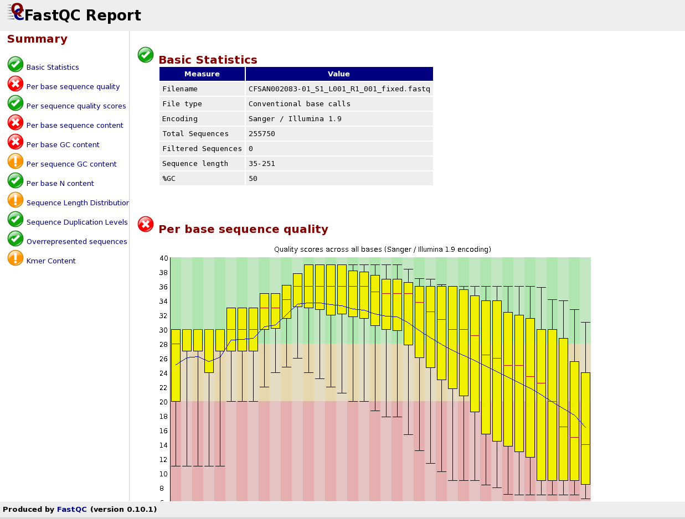
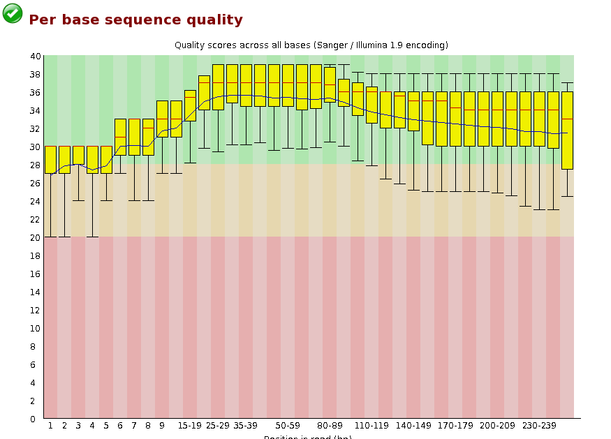

## Curso de Iniciación a la Secuenciación Masiva
BU-ISCIII

### Práctica: Control de Calidad y preprocesamiento de ficheros fastq

#### Descripción
Para esta parte de la práctica vamos a utilizar los datos que se encuentran en la carpeta 02_preprocessing.

Cambiamos al directorio RAW y visualizamos uno de los ficheros. Se trata de datos provenientes de una secuenciación por MiSeq de 2x251, es decir, datos paired-end de 251 nt de longitud.

```bash
# Comprobamos donde estamos situados.
pwd
# Output: /home/alumno/ngs_course_exercises/01_fastq_format/prueba_454

# Nos movemos a la carpeta que contiene la segunda parte de la practica
# Recordatorio: - con .. accedemos a la carpeta inmediatamente superior a la que nos encontramos.
#               - con ../.. subiríamos dos niveles en el árbol de directorios.
cd ../../02_preprocessing

# Comprobamos que estamos donde debemos estar
pwd
# Output: /home/alumno/ngs_course_exercises/02_preprocessing

# Listamos el contenido de la carpeta
ls
# Output:RAW  RESULTS  RESULTS_CORRECTED

# Nos movemos a la carpeta RAW
cd RAW

# Visualizamos el contenido del fichero fastq
less CFSAN002083-01_S1_L001_R1_001_fixed.fastq
# Recordatorio: para salir del comando less presionando q
```

Volvemos a la carpeta del análisis. Lo primero que vamos a hacer es utilizar el programa FastQC, que nos permite hacer un control de calidad de los ficheros tal y como se ha explicado en teoría.

```bash
# Volvemos al directorio de análisis
cd ..

# Comprobamos donde estamos situados
pwd

# Realizamos el análisis de calidad con fastqc
fastqc -t 4 RAW/CFSAN002083-01_S1_L001_R1_001_fixed.fastq RAW/CFSAN002083-01_S1_L001_R2_001_fixed.fastq -o RESULTS/QC/RAW
```

Aquí estamos ejecutando el programa y diciéndole los ficheros que tiene que analizar y con el parámetro “-o” el directorio donde queremos que se guarden los resultados. El parámetro “-t” indica cuántos núcleos del procesador puede utilizar.

En el explorador de ventanas vamos a visualizar los resultados. Recordad que se encuentran en donde habéis dicho al programa que los guarde es decir /home/alumno/ngs_course_exercises/02_preprocessing/RESULTS/QC/RAW.

Ahí hay dos ficheros fastqc_report.html, uno por cada fichero fastq analizado. Hacemos doble click sobre uno de los ficheros html y se abrirá el explorador Firefox.

Estaremos visualizando ahora el resultado del fastQC con todas las gráficas que se han visto en teoría. Estas estadísticas nos permitirán tomar una decisión en cuanto al preprocesamiento de los datos, si tienen buena calidad, si necesitan filtrado, si necesitan trimming en los extremos, ...



El convenio de “buena” calidad de una base en una lectura es de 20 de calidad Phred, si vamos a hacer variant calling, p.e. incluso sería recomendable un mínimo de 30. Según este principio:

* ¿Consideráis que este experimento es de buena calidad?
* ¿De cuántas lecturas partimos?
* ¿Creéis necesario realizar filtrado?
* ¿Creéis necesario realizar trimming?

Este ejemplo ha sido seleccionado por ser especialmente de mala calidad, cuánto más largas sean las lecturas normalmente peor calidad nos encontramos y más complejo se hace el preprocesamiento para poder tener un buen balance entre no perder muchas reads y no utilizar malos datos en nuestro análisis.

En este caso evaluando la calidad nos encontramos con 255570 reads de entre 35 y 251 nt de longitud con una caída de calidad en el inicio 5’ típica de la tecnología HiSeq y MiSeq de Illumina, pero también vemos una calidad media bastante baja que cae de forma brusca en el extremo 3’.

Vamos a realizar varias pruebas para ver qué aproximación de preprocesamiento es la mejor.

#### Filtrado por calidad

Para realizar el filtrado por calidad vamos a utilizar el software NGSQCToolkit, con el script IlluQC_PRLL.pl. Este script es específico para filtrado de reads de Illumina

```bash
# Realizamos filtrado de lecturas por calidad
IlluQC_PRLL.pl -c 4  \
-pe RAW/CFSAN002083-01_S1_L001_R1_001_fixed.fastq \
RAW/CFSAN002083-01_S1_L001_R2_001_fixed.fastq N A \
-l 70 -s 20 -o RESULTS/QC/FILTERED

# Realizamos el anaĺisis de calidad
fastqc -t 4 RESULTS/QC/FILTERED/CFSAN002083-01_S1_L001_R1_001_fixed.fastq_filtered \
RESULTS/QC/FILTERED/CFSAN002083-01_S1_L001_R2_001_fixed.fastq_filtered \
-o RESULTS/QC/FILTERED
```

```
###########################################
#     Ayuda del comando - no ejecutar     #
###########################################

Parámetros:
-pe: indica los ficheros paired end de entrada + N (sin fichero de adaptadores para quitar) + A (detección automática de formato)
-l Porcentaje de reads que tienen que tener más calidad phred de la dada.
-s umbral de calidad phred
```

Abrimos en el explorador de ventanas como en el caso anterior en RESULTS/QC/FILTERED

Doble click sobre CFSAN002083-01_S1_L001_R1_001_fixed.fastq_filtered_fastqc.html y observamos los resultados.
* ¿Hemos mejorado notablemente la calidad?
* ¿Cuántas lecturas hemos perdido?

#### Trimming + filtrado por calidad

Ahora vamos a realizar antes del filtrado por calidad un proceso de trimming en los extremos. Utilizamos el software trimmomatic para ello. A continuación vamos a lanzar NGSQCtoolkit.

```bash
# Realizamos trimming de las lecturas
trimmomatic PE \
RAW/CFSAN002083-01_S1_L001_R1_001_fixed.fastq RAW/CFSAN002083-01_S1_L001_R2_001_fixed.fastq \
RESULTS/QC/TRIMMING_FILTERED/CFSAN002083-01_S1_L001_R1_001_fixed.fastq_trimmed \
RESULTS/QC/TRIMMING_FILTERED/CFSAN002083-01_S1_L001_R1_001_fixed.fastq_se_trimmed \
RESULTS/QC/TRIMMING_FILTERED/CFSAN002083-01_S1_L001_R2_001_fixed.fastq_trimmed \
RESULTS/QC/TRIMMING_FILTERED/CFSAN002083-01_S1_L001_R2_001_fixed.fastq_se_trimmed \
SLIDINGWINDOW:4:20

# Realizamos filtro de las lecturas
IlluQC_PRLL.pl -c 4 \
-pe RESULTS/QC/TRIMMING_FILTERED/CFSAN002083-01_S1_L001_R1_001_fixed.fastq_trimmed \
RESULTS/QC/TRIMMING_FILTERED/CFSAN002083-01_S1_L001_R2_001_fixed.fastq_trimmed N A \
-l 70 -s 20 -o RESULTS/QC/TRIMMING_FILTERED/

# Realizamos análisis de calidad
fastqc -t 4 RESULTS/QC/TRIMMING_FILTERED/CFSAN002083-01_S1_L001_R1_001_fixed.fastq_trimmed_filtered \
RESULTS/QC/TRIMMING_FILTERED/CFSAN002083-01_S1_L001_R2_001_fixed.fastq_trimmed_filtered \
-o RESULTS/QC/TRIMMING_FILTERED/
```

```
###########################################
#     Ayuda del comando - no ejecutar     #
###########################################

Input:
CFSAN002083-01_S1_L001_R1_001_fixed.fastq
CFSAN002083-01_S1_L001_R2_001_fixed.fastq

Output:
CFSAN002083-01_S1_L001_R1_001_fixed.fastq_trimmed <- paired-end R1 que han quedado en pareja.
CFSAN002083-01_S1_L001_R1_001_fixed.fastq_se_trimmed <- paired-end R1 que han quedado sin pareja.
CFSAN002083-01_S1_L001_R2_001_fixed.fastq_trimmed
CFSAN002083-01_S1_L001_R2_001_fixed.fastq _se_trimmed

Parámetros:
PE: indica que la librería es paired-end
SLIDINGWINDOW: número de bases:calidad de la base → Ej (4:20)
```

Abrimos en el explorador de ventanas como en el caso anterior en  RESULTS/QC/TRIMMING_FILTERED

Doble click sobre CFSAN002083-01_S1_L001_R1_001_fixed.fastq_trimmed_filtered_fastqc.html y observamos los resultados.
* ¿Hemos mejorado notablemente la calidad?
* ¿Cuántas lecturas hemos perdido con esta aproximación?



#### Resolución:

Se observa con este ejemplo la importancia del análisis de la calidad y del pre-procesamiento de los datos.

En muchos casos sólo con el paso de filtrado es suficiente para quedarnos con una calidad aceptable para el posterior análisis de los datos.

Pero en otros casos como el ejemplo con el que hemos trabajado hoy es necesario realizar un trimming por los extremos previo al filtrado, ya que el principal problema de calidad de las reads es que los errores se concentran en el final. De manera que sólo con el filtrado no se consigue eliminar el problema ya que las reads malas tienen un alto porcentaje de nucleótidos de buena calidad pero unos extremos muy malos que es lo que estropean el dato.

De hecho, perdemos más reads realizando sólo el paso de filtrado, que realizando trimming y luego filtrado.
