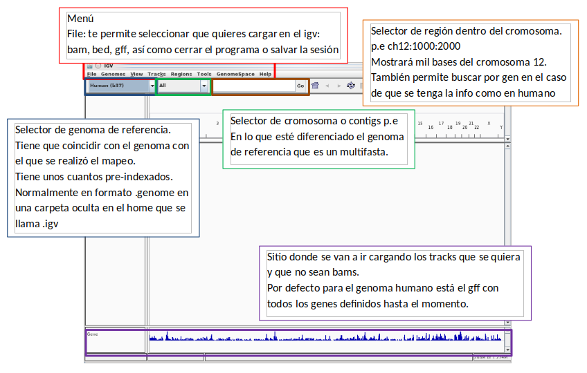
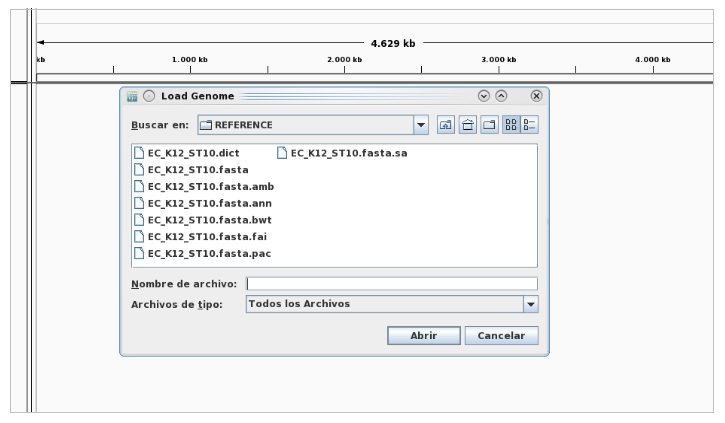
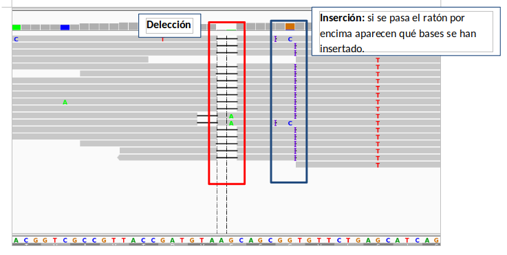
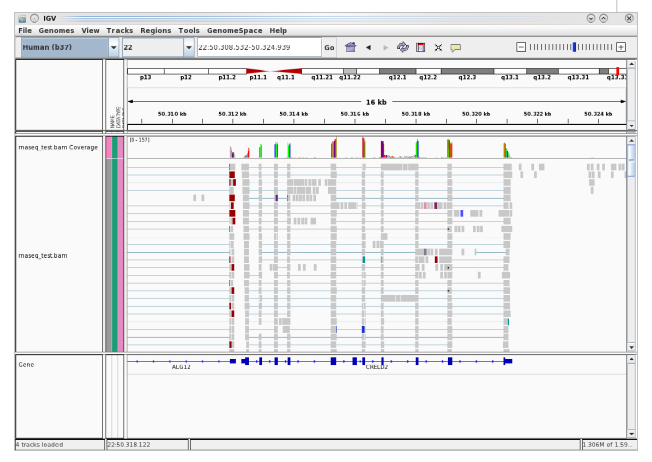
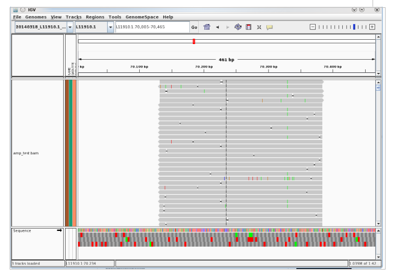

## Curso de Iniciación a la Secuenciación Masiva
BU-ISCIII

### Práctica 2 día 6: Mapado y control de calidad

17-28 Mayo 2021, 8a Edición, Programa Formación Continua, ISCIII


#### Descripción
Nos vamos a mover a un nuevo directorio que contiene los datos que vamos a utilizar en esta parte de la práctica. Hacemos como siempre, accedemos con la interfaz gráfica a la carpeta 03_mapping_qc. Y comprobamos como sigue la estructura de directorios, vemos que hay una carpeta RAW, una carpeta de RESULTS donde vais a ir guardando vuestros resultados, una carpeta RESULTS_CORRECTED donde están los resultados ya pre-computados y, por último, una carpeta REFERENCES con el genoma de referencia una cepa de E. coli que es la que vamos a utilizar para este ejercicio. También veréis una carpte TMP, cuya finalidad es almacenar archivos temporales durante la ejecución de los programas.

```bash
# Comprobamos donde estamos situados
pwd
#Output: /home/alumno/curso_NGS/dia3/handson_dia3/02_qc_preproc

# Nos movemos a la carpeta que contiene la tercera parte de la practica
cd ../03_mapping_qc

# Listamos el contenido del directorio
ls
# Output: RAW  REFERENCE  RESULTS  RESULTS_CORRECTED  TMP

# Nos movemos a la carpeta RAW
cd RAW

# Listamos el contenido del directorio
ls
#Output:CFSAN002083-01_S1_L001_R1_001.fastq  CFSAN002083-01_S1_L001_R2_001.fastq
```

Vamos a utilizar el programa bwa (burrows-wheeler aligner), que es uno de los más utilizados para datos obtenidos de Illumina. Tiene dos modos uno para reads “cortas” de menos de 100 pb (bwa aln y sampe) y otro para reads más “largas”(bwa mem) , al principio más pensado para reads de 454 pero ahora ya también para reads largas de MiSeq.

Vamos a realizarlo con las mismas lecturas que hemos filtrado en el ejercicio anterior y que ahora se encuentran enlazadas en la carpeta RAW como hemos visto al recorrer la estructura de carpetas.

Para saber qué modo de bwa tenemos que utilizar tenemos que saber de qué longitud son las reads de nuestro experimento.

¿Recordáis de qué longitud eran las reads del experimento analizado en 02_qc_preproc? Si no os acordáis podéis revisar los datos de QC/TRIMMED_FILTERED, y ver en el report en html la longitud de los reads.

**¿Qué módulo de bwa tenemos que usar bwa aln/sampe o bwa mem?**

Lo primero que hay que hacer cuando vamos a realizar un proceso de mapeo típico de experimentos de resecuenciación es ver qué referencia vamos a utilizar. En el caso de microorganismos es un proceso importante ya que hay referencias disponibles de muchas cepas y debemos seleccionar el genoma de referencia de la misma cepa si es posible o de la más cercana a la que hemos secuenciado. La eficiencia del mapeo es muy dependiente de seleccionar la referencia de manera adecuada.

El primer paso que hay que realizar, por tanto, es descargar nuestro genoma de referencia, que se trata de un fichero en formato fasta con la secuencia completa del genoma del organismo. Nosotros ya lo tenemos descargado en REFERENCES.

El segundo paso es indexarlo, es decir generar un formato modo índice que el programa de alineamiento, en nuestro caso bwa va a utilizar para acelerar la computación. Cada programa de alineamiento genera sus propios ficheros de indexación.

```bash
# Nos movemos a la carpeta REFERENCE
cd ../REFERENCE

# Indexamos la referencia
bwa index EC_K12_ST10.fasta
```

Si el programa ha funcionado sin ningún error tendremos nuestro genoma de referencia indexado, y en nuestra carpeta REFERENCES habrán aparecido una serie de ficheros con extensión .ann, .bwt, etc.

A continuación, vamos a realizar el mapeo para generar nuestros ficheros en formato SAM ya mapeado como se ha explicado en teoría.

Como habréis comprobado en este caso estamos tratando con datos de lecturas largas, por lo que tendremos que utilizar el módulo bwa mem para mapear nuestros datos. Como ya tenemos indexado nuestro genoma pondremos por la línea de comandos:

```bash
# Mapamos las lecturas contra la referencia
cd ..
bwa mem -t 2 REFERENCE/EC_K12_ST10.fasta \
RAW/CFSAN002083-01_S1_L001_R1_001.fastq \
RAW/CFSAN002083-01_S1_L001_R2_001.fastq \
> RESULTS/Alignment/CFSAN002083-01_S1_L001.sam
```

**¿Cuánto ocupa el fichero que acabamos de generar? (du -sh RESULTS/Alignment/CFSAN002083-01_S1_L001.sam)**

Como se ha explicado en teoría el formato sam permite almacenar información de alineamiento, pero suele ocupar mucho espacio por lo que se suele utilizar su formato binario. Para realizar esta conversión:

```bash
# Convertimos de sam a bam
samtools view -Sb RESULTS/Alignment/CFSAN002083-01_S1_L001.sam > RESULTS/Alignment/CFSAN002083-01_S1_L001.bam
```

**¿Cuánto ocupa el fichero BAM que acabamos de generar? (du -sh RESULTS/Alignment/CFSAN002083-01_S1_L001.bam)**

**¿Cuánto hemos disminuido el tamaño?**

El problema, ahora no podemos visualizar el fichero con un simple more, podéis probar si queréis y veréis como lo que se visualiza son un montón de símbolos sin ningún significado para un humano.

Pero no hay ningún problema ya que samtools tiene herramientas para permitirnos visualizar y analizar la información dentro de un fichero bam.

Con este comando visualizamos el fichero bam como si fuera un sam.

```bash
# Visualizamos el fichero bam
samtools view RESULTS/Alignment/CFSAN002083-01_S1_L001.bam | more

#Recordatorio: para salir del comando more se utiliza q o CTRL+C
```

A continuación prepararemos nuestro fichero BAM para poder trabajar con él en los siguientes pasos del análisis, incluido el control de calidad.

Para que estos programas que realizan cálculos sobre la información contenida en el bam puedan acelerar el tiempo con el que realizan los análisis, el fichero bam tiene que estar ordenado por cromosoma y por posición, es decir los reads al principio del fichero son los que se corresponden al del cromosoma 1. Esto va a permitir que si un programa tiene que realizar una búsqueda en un fichero pueda ir por orden y lo encuentre más rápido. Además muchos programas necesitan un índice del fichero bam que suele tener extensión .bai, este fichero funciona como el índice de un libro, y permite a los programas que si por ejemplo lo que van a buscar está en el cromosoma 12, pues que sepan en qué parte del fichero tienen que empezar a leer para encontrarlo más rápidamente, además de saber cuántos cromosomas, etc. tiene el fichero de antemano, sin tener que leer el bam entero.

Para ordenar, generar un índice del fichero bam:

```bash
# Ordenamos las lecturas por orden cromosómico
samtools sort RESULTS/Alignment/CFSAN002083-01_S1_L001.bam \
-o RESULTS/Alignment/CFSAN002083-01_S1_L001_sorted.bam
# Indexamos el fichero bam
samtools index RESULTS/Alignment/CFSAN002083-01_S1_L001_sorted.bam
```

Ahora si revisamos nuestra carpeta de resultados vemos que tenemos todos los ficheros que necesitamos para continuar con nuestro análisis.

```bash
# Nos movemos a la carpeta donde se ha generado el fichero bam que acabamos de crear
cd RESULTS/Alignment
# Listamos el contenido del directorio
ls
#Output: CFSAN002083-01_S1_L001.bam  CFSAN002083-01_S1_L001.sam  CFSAN002083-01_S1_L001_sorted.bam  CFSAN002083-01_S1_L001_sorted.bam.bai
```

El fichero sam podríamos borrarlo ya que es la misma información que hay en el bam. Así como el fichero bam sin ordenar. Todo lo que hagamos será a partir del fichero ordenado.

#### Obtener estadísticas de cómo ha ido el proceso

En este paso se realiza el segundo control de calidad de nuestros datos. Se evalúa principalmente:

* Eficacia del alineamiento

* Cobertura y distribución de los reads en nuestro experimento.

La manera más sencilla de realizar un análisis para saber cómo ha ido el alineamiento es estudiar las estadísticas de los flags del bam, que se han explicado en teoría.

```bash
# Utilizamos flagstat para ver estadísticas del fichero bam
samtools flagstat CFSAN002083-01_S1_L001_sorted.bam
```

Este comando nos da un resumen de lo que contiene el bam.
* Número de reads + número de reads que han fallado QC
* Número de duplicados + “ ”
* Número de reads mapados correctamente + “ “
* Número de reads paired-end + “ “
* Número de reads 1
* Número de reads 2
* Número de reads pareados correctamente
* Número de singletons
* Número de reads con su pareja en otro cromosoma.

Sin liarnos mucho, lo que nos dice cómo de bien ha ido el mapeo es el número de reads que han mapeado.

**¿Cuál es el porcentaje de reads mapados?**

Para el cálculo de la cobertura y otras estadísticas de cómo se distribuyen las lecturas por el genoma hay que utilizar otra serie de programas que realizan estos cálculos.

Primero vamos a utilizar un programa llamado picard que consta de una suite de varios software con distinta funcionalidad para tratar con ficheros bam. En este caso usamos CollectWgsMetrics.

```bash
# Utilizamos Picard para ver estadísticas del fichero bam
picard CollectWgsMetrics \
    COVERAGE_CAP=1000000 \
    INPUT=CFSAN002083-01_S1_L001_sorted.bam \
    OUTPUT=CFSAN002083-01_S1_L001.CollectWgsMetrics.coverage_metrics \
    REFERENCE_SEQUENCE=../../REFERENCE/EC_K12_ST10.fasta \
    COUNT_UNPAIRED=true \
    VALIDATION_STRINGENCY=LENIENT \
    TMP_DIR=../../TMP
```

Se genera un archivo en RESULTS/Alignment que se puede abrir con el excel para visualizarlo más cómodamente. Si pregunta le diremos que nos separe las columnas por tabulador. Solo redordaros que excel es parte de la suite Microsoft Office que no está disponible nativamente en sistemas linux, por lo que en las máquinas virtuales normalmente utilizaréis una de sus alternativas opensource como Libre Office calc.

Se trata de un fichero muy largo del que solo nos interesan las priemras 8 líneas. En este fichero encontramos mucha de la información que ya habíamos obtenido con samtools, pero además también nos calcula uno de los parámetros que más utilizamos para saber si podemos realizar nuestro siguiente análisis con fiabilidad: la cobertura media y el porcentage de genoma a cierta profundiad. (En el fichero las columnas que pone MEAN_COVERAGE (segunda columna) y PCT_1X (columnas 14 en adelante)).

**¿Qué cobertura tenemos en este experimento?**

#### Eliminar duplicados

Como se ha visto en teoría, es recomendable eliminar duplicados previsiblemente debido a artefactos de PCR antes de realizar los siguientes pasos del análisis ya que pueden dar lugar a errores.

Para eliminar duplicados se utiliza el programa picard explicado anteriormente. En este caso utilizamos MarkDuplicates.

```bash
# Eliminamos duplicados en el fichero bam
picard MarkDuplicates REMOVE_DUPLICATES=TRUE \
ASSUME_SORTED=TRUE VALIDATION_STRINGENCY=LENIENT \
INPUT=CFSAN002083-01_S1_L001_sorted.bam \
OUTPUT=CFSAN002083-01_S1_L001_noduplicates.bam \
METRICS_FILE=picard.metrics_file \
TMP_DIR=../../TMP

# Obtenemos estadísticas del fichero sin duplicados
picard CollectWgsMetrics \
    COVERAGE_CAP=1000000 \
    INPUT=CFSAN002083-01_S1_L001_noduplicates.bam \
    OUTPUT=CFSAN002083-01_S1_L001_noduplicates.CollectWgsMetrics.coverage_metrics \
    REFERENCE_SEQUENCE=../../REFERENCE/EC_K12_ST10.fasta \
    COUNT_UNPAIRED=true \
    VALIDATION_STRINGENCY=LENIENT \
    TMP_DIR=../../TMP
```

**¿Cuántos duplicados había en el fichero bam?**

**¿Ha variado mucho la cobertura?**

En este caso el número de reads con los que nos quedamos no varía demasiado ya que el número de duplicados es muy bajo.

En otros experimentos con otro tipo de librerías u otro tipo de manipulación de la muestra el número de duplicados puede llegar hasta el 30 o el 40% de los reads, siendo muy importante eliminarlos ya que pueden tener mucha transcendencia en análisis posteriores como puede ser la llamada a variantes.

#### Visualización en IGV de experimentos reales de exoma, amplicones  y RNA-Seq.

En esta parte de la práctica vamos a realizar un pequeño tutorial de manejo básico del visor IGV. Este programa nos permite visualizar ficheros bam en el contexto genómico, además de permitirnos añadir diversos tracks personalizados como modelo de genes, datos de chips de metilación, etc.

Realizaremos:
* Visión general de la aplicación.
* Cómo cargar un genoma personalizado para visualizar el experimento que hemos mapeado en la parte anterior.
* Cómo cargar un genoma ya preindexado en la aplicación.
* Visualización de datos de exoma, amplicones y RNASeq, investigando algunas de las funcionalidades de IGV.

Lo primero abrimos IGV. Para ello, si no tenemos icono desde el escritorio ni aparece como programa detectado, tenemos que saber dónde se ha instalado IGV y ejecutarlo desde la terminal. Los programas con interfaz gráfica se pueden lanzar y usar desde línea de comando, ofreciendo a veces mayores funcionalidades que quedan ocultas en el modo gráfico:

```bash
igv
```

**Visión general de la aplicación**



**Cargar un genoma personalizado**

Esto es muy útil sobre todo cuando se trabaja con microorganismos ya que por defecto la aplicación sólo permite los más comunes.

Si pulsamos en Genomes en el menú principal, vamos a observar diferentes maneras de cargar un genoma, bien desde un fichero, desde una url o desde el servidor.
* Desde fichero: aceptará un genoma en formato fasta.
* Desde url: si tenemos el genoma subido en algún servidor
* Desde servidor: igv accede al servidor de Broad Institute y tiene una serie de genomas que te puedes descargar directamente.

Vamos a suponer que nuestro genoma no se encuentra en la lista del Broad Institute. Pincharemos en Genomes > Load Genome from file… y buscaremos el directorio donde tenemos nuestro genoma de referencia que utilizamos para mapear en el paso anterior. Seleccionamos aquel que tiene extensión fasta y damos en Abrir. Lo único que necesita IGV es el fichero fasta y el fichero .fai que es el índice que produce samtools con el comando samtools faidx, en este caso ese índice ya lo tenemos generado, si no estuviese o bien lo tendríamos que generar o lo intentaría gnerar IGV durante el proceso de carga.



Una vez cargado veremos que este genoma nos aparece en la barra de herramientas donde hemos visto que se selecciona el genoma de referencia, y en el selector de cromosoma están los cromosomas con contigs definidos en este genoma de referencia, en nuestro caso se trata de E. Coli y sólo hay un cromosoma posible para seleccionar.

Para visualizar el mapeo que realizamos en el paso anterior y ver que todo funciona bien, vamos a cargar el bam que generamos. Pinchamos en el Menú en File > Load from file… y buscamos nuestro fichero bam, el último el de noduplicates.bam y le damos a Abrir.

**¿Obtenéis algún error? ¿Qué falta?**

Si recordáis cuando generamos el primer bam lo ordenamos y generamos su índice que es un fichero en .bai que permite acelerar la computación sobre este tipo de ficheros. Pero cuando quitamos los duplicados no lo volvimos a generar para este fichero. Hagámoslo ahora. Id desde el apartado gráfico (o por terminal si os veis capaces) y buscad donde tenemos guardado este fichero bam en RESULTS/Alignment/ en el handson_dia3. Abrimos una terminal en esa ubicación y hacemos como antes.

```bash
# Muevete hasta la carpeta donde está el archivo bam si te has movido a otro directorio
samtools index CFSAN002083-01_S1_L001_noduplicates.bam
```

Volvemos a IGV y volvemos a cargar el fichero bam noduplicates. Ahora debería cargarse sin problemas aunque no visualicemos nada en el centro de la pantalla es porque necesitamos hacer zoom.


A tener en cuenta:

* Los reads en gris son reads que han mapeado correctamente. Pasando el ratón por encima de un read da la información de los flags recogidos en el bam: el nombre del read, el cigar, dónde empieza el alineamiento, la base que tiene en esa posición la secuencia, el score de alineamiento, etc.

* También nos podemos encontrar reads de otros colores como blanco (cuando la calidad de mapeo es 0), estos reads están ahí mapeados como podrían estar en otro sitio son reads que o bien no tienen un sitio único de mapeo o que no han podido mapearse. Otros colores identificativos de IGV es el rojo o el azul, que se corresponde con irregularidades en el tamaño del inserto del fragmento (la distancia entre el forward y el reverse), etc. Para más información sobre esto ver el tutorial del igv (http://www.broadinstitute.org/software/igv/).

* Si pasamos con el ratón por encima del track de histograma de la profundidad vemos un desglose de lo que nos encontramos en esa posición. El número de reads que caen en esa posición, y qué nucleótido presenta su secuencia en esa posición. P.e en la figura se observa la información con una posición que contiene un snp, en esa posición hay una profundidad de 20 reads, todos los reads para esa posición presentan una A. Además, se da información de cuántos de esos reads son forward y cuantos reverse (14 forward y 6 reverse).


* Ya estamos viendo que los mistmaches puntuales con la referencia se muestran mostrando el nucleótido en un color para cada base en la lectura. En el caso de indels e inserciones se visualizan como muestra la imagen. Moveos un poco por el bam para encontrar alguna.



**Visualización de bam de exoma**

Los datos de prueba para esta parte de la práctica se encuentran en /home/alumno/cursoNGS/dia3/04_genome_visualization.

Seleccionamos el genoma de referencia human(b37) y cargamos el bam que se llama exome_test.bam.

Podéis investigar un poco el fichero con todas las cosas que hemos ido viendo hasta el momento de IGV. La principal diferencia que vamos a ver es cómo sólo vamos a encontrar reads mapeados en exones ya que son las zonas que se han enriquecido en el proceso de preparación de la librería.

Por ejemplo en la imagen se ve la zona del gen CRELD2 en el cromosoma 22.


**Visualización de bam de RNASeq**

Ahora vamos a cargar el fichero que se llama rnaseq_test.bam, y vamos a ver las diferencias. Este fichero se ha generado no mapeando con bwa sino con otro software de mapeo especializado para RNASeq  (tophat). Este software lo que hace es mapear cDNA proveniente del RNA de un organismo contra ADN genómico, de forma que tiene que buscar las zonas de ruptura de los intrones  (splicing sites) y marcarlo en el CIGAR como que la lectura continúa en el siguiente exón que estará a x distancia.

Por ejemplo vemos en la figura con el nuevo bam también el gen CRELD2. Observamos como una read empieza mapada en un exón y cuando llega al final se “parte” y continúa en el siguiente.



**Visualización de amplicones**

Vamos a visualizar un experimento de secuenciación de amplicones donde se secuencia un exón del gen RB1. La secuenciación se ha hecho de tal manera que el tamaño del fragmento sea de 250 pb y el tamaño de la lectura también sea de 250 pb. De esta manera los paired-end se solaparán completamente y tendremos cada fragmento secuenciado dos veces, en forward y en reverse.

Lo primero que tenemos que hacer es cargar en igv la referencia en formato fasta del gen RB1 tal y como hemos visto anteriormente en este tutorial. La referencia se encuentra en la carpeta TEST de donde estamos sacando todos los bam de prueba.

A continuación seleccionáis la nueva referencia y cargáis el bam que se llama amplicon_test.bam.
>**Nota:** El amplicón está en la zona 70.000pb de la referencia.



**¿Qué cobertura aproximada tenemos en este experimento?**

**¿Encontráis algún polimorfismo?**
