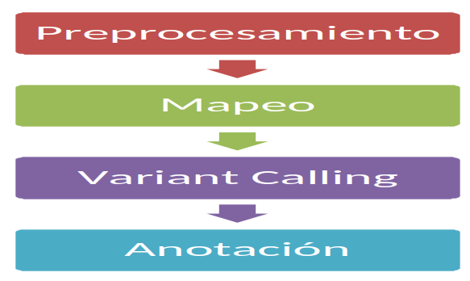
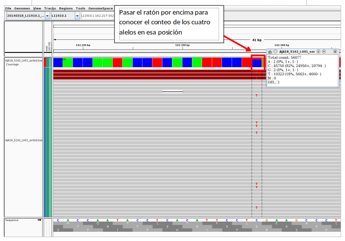

## Curso de Iniciación a la Secuenciación Masiva
BU-ISCIII

### Práctica: Variant Calling

#### Descripción
En esta práctica vamos a analizar un pequeñísimo experimento de Deep sequencing dónde se ha secuenciado un único exón de un gen en una muestra de una línea celular.

Vamos a realizar todos los pasos necesarios para analizar estos datos con el objetivo de determinar qué variantes respecto a referencia podemos encontrar en nuestros datos. Vamos a realizar el control de calidad, el preprocesamiento, vamos a mapear directamente contra el gen secuenciado y vamos a utilizar samtools para obtener el conteo de bases en todas las posiciones del amplicón.

El objetivo de esta práctica es, por tanto, que asimiléis todo lo que hemos ido viendo por partes el resto de días, y que podáis entender la secuencia de pasos que hay que realizar para analizar datos de secuenciación masiva.



#### Control de Calidad y Pre-procesamiento

Lo primero como la práctica del día 3 vamos a realizar el primer control de calidad. Nos situamos en la carpeta dia4/handson_dia4 en una terminal, bien por línea de comandos o bien yendo por el entorno gráfico y abriendo una terminal en esa localización.

En la carpeta RAW, donde se encuentran los datos crudos fastq, id investigad esos ficheros fastq.

```bash
# Copiamos la práctica de hoy a nuestro directorio de trabajo.
cd /home/alumno/ngs_course_exercises
cp -r /mnt/ngs_course_shared/04_handson_variantcalling/ .
# Entramos dentro de la carpeta de la práctica
cd 04_handson_variantcalling
# Comprobamos que estamos localizados en el directorio con los datos para esta práctica: /home/usuario/cursoNGS/dia4/handson_dia4
pwd
# Nos movemos a la carpeta RAW
cd RAW
# Visualizamos el fichero fastq
zcat AJA18_S162_L001_R1_PE.fastq.gz | less
# Para salir pulsamos la tecla q

# Volvemos a la carpeta superior
cd ..
```

**¿Es un experimento paired-end o single-end?**

**¿Es Illumina? ¿HiSeq o MiSeq?**

```bash
# Realizamos el análisis de calidad
fastqc -t 2 RAW/AJA18_S162_L001_R1_PE.fastq.gz RAW/AJA18_S162_L001_R2_PE.fastq.gz -o RESULTS/QC/RAW
```

Cuando haya terminado vamos a ver los resultados, id a RESULTS/QC y dentro de la carpeta que se ha generado doble click en fastqc_report.html. Lo que vamos a ver es que fastQC nos avisa que en casi todos los apartados hay un error, hay que tener en cuenta que este programa está pensado para secuenciación de exoma o genoma completo, de manera que se espera una distribución homogénea de los reads en un espacio genómico más o menos grande. En este caso estamos analizando un único amplicón de 250 pb, de forma que la distribución de A,G,T,C por posición de la read va a ser siempre la misma y no homogénea ya que todas las reads caen en las mismas 250 pb. La misma explicación sirve para las secuencias sobrerrepresentadas o los Kmer (se secuencia un único amplicón) o incluso los porcentajes en GC.

Es muy importante por tanto saber de qué partimos y de qué nos está avisando el programa para ser capaces de interpretar si nuestros datos tienen buena calidad o no.

En este caso la gráfica que nos interesa es la primera donde nos dice la calidad por posición, vemos que es una calidad bastante buena exceptuando las últimas poquitas bases donde cae bastante la calidad. Vamos a realizar por tanto la aproximación que seguimos en la práctica de preprocesado y vamos a utilizar fastp para cortar por extremo y filtrar por calidad. Vamos a ser muy estrictos en este caso ya que tenemos muy pocas bases a muchísima cobertura por lo que no nos preocupa perder reads que nos puedan dar lugar a error más tarde.

**¿De cuántas reads partimos?**

**¿Si el amplicón es de 250 pb y los reads son de 250 pb? ¿Sabríais estimar la profundidad que vamos a tener por posición?** (partimos del número de reads (número de forward + número de reverse) multiplicado por tamaño en nucleótidos del read y dividido por el tamaño de la región secuenciada)

Vamos a realizar por tanto paso de trimming, paso de filtrado y otro paso de control de calidad para ver si todo ha ido correctamente y ver cuántas reads hemos perdido. Observad que en este caso vamos a poner de umbral phred 30 en vez de 20, vamos a ser más estrictos.

```bash
# Realizamos el preprocesamiento de las lecturas
fastp -i RAW/AJA18_S162_L001_R1_PE.fastq.gz \
      -I RAW/AJA18_S162_L001_R2_PE.fastq.gz \
      -o RESULTS/QC/TRIMMING_FILTERED/AJA18_R1_trimmed.fastq \
      -O RESULTS/QC/TRIMMING_FILTERED/AJA18_R2_trimmed.fastq \
      -j RESULTS/QC/TRIMMING_FILTERED/fastp.json \
      -h RESULTS/QC/TRIMMING_FILTERED/fastp.html \
      --qualified_quality_phred 20 \
      --unqualified_percent_limit 30 \
      --cut_front --cut_tail \
      --trim_poly_x \
      --cut_mean_quality 30 \
      --cut_window_size 10 \
      --length_required 50

# Y analizamos su calidad después del filtrado
fastqc -t 2 \
RESULTS/QC/TRIMMING_FILTERED/AJA18_R1_trimmed.fastq \
RESULTS/QC/TRIMMING_FILTERED/AJA18_R2_trimmed.fastq \
-o RESULTS/QC/TRIMMING_FILTERED/
```

Revisamos la salida de fastqc en RESULTS/QC/TRIMMING_FILTERED con el fichero R1 por ejemplo.

**¿Cuántas reads hemos perdido?**

**¿Hemos conseguido mejorar la calidad?**

#### Mapado y control de calidad

Ahora que tenemos nuestras secuencias con filtros de calidad pasamos al análisis de mapeo.

Primero, como en la práctica del día 3, vamos a indexar nuestra referencia que se encuentra en REFERENCE. Se trata de un fichero fasta con la secuencia del gen que contiene el exón secuenciado.

```bash
# Indexamos la referencia para el mapping
bwa index REFERENCE/20140318_L11910.1_RB.fasta

# Mapamos las lecturas contra la referencia
bwa mem -t 4 REFERENCE/20140318_L11910.1_RB.fasta \
RESULTS/QC/TRIMMING_FILTERED/AJA18_R1_trimmed.fastq \
RESULTS/QC/TRIMMING_FILTERED/AJA18_R2_trimmed.fastq \
> RESULTS/Alignment/AJA18.sam
```

Y al igual que en la práctica del día 3 vamos a pasar a formato bam, ordenar e indexar para poder seguir trabajando con nuestros datos.

```bash
# Convertimos de sam a bam
samtools view -Sb RESULTS/Alignment/AJA18.sam \
> RESULTS/Alignment/AJA18.bam
# Ordenamos el fichero bam
samtools sort -T AJA18 -o RESULTS/Alignment/AJA18_sorted.bam RESULTS/Alignment/AJA18.bam 
# Indexamos el fichero bam
samtools index RESULTS/Alignment/AJA18_sorted.bam
```

A continuación, vamos a sacar alguna estadística de nuestro mapeo a ver cómo ha ido, vamos a utilizar samtools y bamUtil como anteriormente.

```bash
# Utilizamos flagstat para ver estadísticas del fichero bam
cd RESULTS/Alignment
samtools flagstat AJA18_sorted.bam

# Utilizamos bamUtil para ver estadísticas del fichero bam
picard CollectWgsMetrics \
    COVERAGE_CAP=1000000 \
    INPUT=AJA18_sorted.bam \
    OUTPUT=AJA18.coverage_metrics \
    REFERENCE_SEQUENCE=../../REFERENCE/20140318_L11910.1_RB.fasta \
    COUNT_UNPAIRED=true \
    VALIDATION_STRINGENCY=LENIENT \
    TMP_DIR=../../TMP
```

**¿Cuál ha sido el porcentaje mapado?**

**¿Cuántas reads tenemos en total?**

**¿Cuál es la profundidad que nos indica picard que tenemos?**

**¿Por qué es distinta a la estimada anteriormente?**

Fijaos que antes hemos calculado la profundidad según el tamaño del amplicón, al programa no le estamos diciendo ese tamaño, sino que estamos mapeando contra el gen entero por lo que el programa nos calcula la cobertura del gen, no sólo del amplicón y esto hace que la cobertura media disminuya considerablemente.

Ahora abrid el IGV y cargad el genoma de 20140318_L11910.1_RB.fasta (carpeta REFERENCE) y el bam que acabamos de generar. Id a la región L11910.1:162,042-162,468, que es donde se localiza el exón secuenciado y por tanto donde se han mapeado las lecturas.

Ahora si siguiésemos lo que hemos realizado en la práctica de mapping ocaría eliminar duplicados. Sin embargo, si recordamos el significado de duplicados, son aquellas lecturas tienen su secuencia exactamente igual a otra. Si os fijáis en el mapeo en IGV os daréis cuenta que según esta definición todos son duplicados, porque estamos secuenciando un único amplicón, un único fragmento de ADN, por lo que no podemos eliminar los duplicados ya que nos quedaríamos sin datos, no podemos diferenciar los duplicados por PCR que sería los que habría que quitar de directamente es una secuencia de ADN que se secuencia muchas veces.

Por lo tanto en estos casos de Deep Sequencing no se suelen quitar duplicados porque se pierde demasiado dato real.

#### Variant Calling

Para realizar la llamada a variantes vamos a utilizar una de las funcionalidades de samtools que se reparte en dos módulos samtools mpileup y bcftools.

```bash
# Llamada a variantes con samtools
cd ../..
conda deactivate
conda create -c bioconda -c conda-forge -n bcftools bcftools samtools
conda activate bcftools
samtools mpileup -d 200000 -ugf REFERENCE/20140318_L11910.1_RB.fasta \
RESULTS/Alignment/AJA18_sorted.bam | bcftools call -mv - \
> RESULTS/variants/var.raw.vcf
```

El parámetro -d es muy importante para el análisis de Deep sequencing ya que indica que se contabilicen posiciones con profundidad menor a 200000 lecturas. Por defecto está puesto en 250 porque está pensado para datos de exoma o genoma completo donde es raro que se supere esa profundidad. En este caso si dejásemos el valor por defecto el programa no tendría en cuenta ninguna de las posiciones del amplicón. Las opciones –gu son para que la salida esté en formato bcf, que es el formato binario del vcf.

En cuanto a los parámetros –mvO v indican que el output esté en vcf (-O v), que se llamen SNPs (-m), que se llamen sólo sitios variantes y que se generen genotipos de cada posición variante (-v).

El formato .vcf se puede leer, y lo estamos redirigiendo a un fichero con extensión vcf que podremos abrir con excell para su exploración en detalle.

Vamos a hacer eso, abrid el explorador de archivos y navegad por las carpetas hasta /home/alumno/ngs_course_exercises/04_handson_variant_calling/RESULTS/variants. Ahí pulsad con el botón derecho del ratón sobre el fichero var.raw.vcf  y pulsad en abrir con LibreOffice Calc. Cuando se abra saldrá una pantalla para preguntaros que carácter de separación de columnas queréis, dejáis sólo con un tick tabulador, y dais a aceptar.

Una vez abierto, explorad el formato, como se dio en teoría la cabecera empieza por “#” y ahí se explica de manera resumida qué significan cada uno de los campos de información del fichero. Se dividen en dos tipos de campos INFO y FORMAT que aparecerán en sendas columnas del fichero.

Después de la cabecera aparece una línea por variante.

**¿Cuántas variantes detecta samtools en nuestro amplicón?**

**Fijémonos en la columna de INFO en el campo que nos da información sobre la profundidad (DP) ¿Cuál es la profundidad de lectura en esta posición donde se encuentra la variante?**

Vamos a abrir IGV para ir visualizando los campos del vcf a la vez que comprobamos la información directamente sobre el bam. Abrimos IGV:

```bash
igv
```

En el desplegable del genoma de referencia hay que seleccionar la referencia del gen RB1. Si en la práctica del día 3 lo cargasteis debería aparecer ya en el desplegable. Si no lo llegasteis a hacer hay que ir a Genomes > Load Genome from file... e ir a la carpeta /home/alumno/cursoNGS/dia4/handson_dia4/REFERENCE y seleccionar el fichero 20140318_L11910.1_RB.fasta.

Una vez tenemos el genoma de referencia cargamos el fichero bam, recordad en File > Load From File… y seleccionamos en /home/alumno/ngs_course_exercises/04_handson_variant_calling/RESULTS/Alignment/ el fichero AJA18_S162_L001_sorted.bam.

Bien, ya tenemos cargado el bam en IGV, volvemos al excell donde tenemos abierto el vcf y copiamos la posición de la variante en la columna POS. Vamos a IGV y en el recuadro de las posiciones escribimos: L11910.1:162237

**¿Cuántas lecturas hay en forward y en reverse para el alelo referencia?**

**¿Cuántas lecturas hay en forward y en reverse para el alelo alternativo?**

Acordaos que esta información se observa al pasar el ratón por encima del histograma de cobertura, en la posición donde se encuentra la variante.



Ahora volvemos al vcf, fijaos en la columna de INFO en el campo DP4, y leer la descripción de este campo en la cabecera.

**¿Cuáles son los cuatro números que aparecen en ese campo?**

**¿Qué dice la descripción que son?**

**¿Se parecen a los números del número de lecturas para alelo referencia y alelo alternativo que apuntamos en IGV?**

Efectivamente, los números son parecidos, pero no exactamente iguales, ya que samtools realiza unos filtros de calidad de los reads y sólo tiene en cuenta aquellos de alta calidad.

**¿En qué frecuencia del alelo alternativo se encuentra la mutación?**

#### Variant Annotation

Hasta ahora hemos realizado preprocesamiento, mapeado y llamada a variantes (variant calling). Es decir, hasta el momento tenemos una lista de mutaciones en formato vcf, en este caso sólo tenemos una, lo que facilita mucho la labor, pero bueno como he dicho este es un experimento muy dirigido.

En el caso de tener una secuenciación de una región mayor tendríamos una lista más grande de mutaciones que tendríamos que priorizar de alguna manera para saber cuál tiene efecto y por tanto puede tener importancia biológica.

Para realizar anotaciones descriptivas y funcionales vamos a utilizar el software variant_effect_predictor, un software de ENSEMBL que utiliza su base de datos para anotar mutaciones. **Sólo se puede utilizar este software si ENSEMBL tiene base de datos para el organismo que se está estudiando.**

En este caso, como se ha realizado directamente contra un solo gen para que el alineamiento, indexación del genoma etcétera fuese rápido tenemos un problema. Las coordenadas de la mutación están respecto al gen y no frente al genoma de referencia por lo que la búsqueda en ENSEMBL no nos dará resultado.

Para que practiquéis la anotación y cómo nosotros sabemos la coordenada de la mutación en genómico vamos a editar el fichero vcf con las posiciones correctas para pasárselo al programa variant_effect_predictor.

Vamos a abrir el fichero var.raw.vcf (RESULTS/variants) con el editor de textos y vamos a sustituir el cromosoma L11910.1 por chr13 y la posición por 49039374. Guardamos, cerramos el editor y volvemos a la terminal.

NOTA: Si estás ejecutando este curso desde una máquina distinta a la máquina virtual del curso, o estás ejecutando desde el container suministrado, necesitarás [descargar la cache](https://www.ensembl.org/info/docs/tools/vep/script/vep_cache.html) de tu versión de VEP en ~/.vep para poder ejecutar la anotación.

```bash
# Anotamos las variantes que hemos obtenido
conda deactivate
conda activate ngs_course
vep -i RESULTS/variants/var.raw.vcf --format vcf --output_file RESULTS/variants/var.raw.vcf_effect.txt --everything  -cache  -dir ~/.vep --offline --fasta REFERENCE/20140318_L11910.1_RB.fasta --force --use_given_ref
```

A este programa le pasamos:
* i : fichero de input
* format: formato en el que está el input
* output_file: fichero de salida
* everything: que nos anote todo lo que sepa anotar, incluye información de gen, de tránscrito, proteína, efecto a nivel funcional, etc.
* cache: indicamos que use la base de datos descargada en local
* dir: dónde está la base de datos
* offline: que no se conecte a la base de datos de ensembl que use la descargada en local (tarda mucho si se tiene que conectar)

Y ya por último podemos revisar los resultados abrimos con Libre Office Calc el fichero que hemos generado var.raw_effect.txt. Vemos que tenemos una serie de columnas con información de gen de tránscrito, de función, etc. que nos clasifican la mutación

¿En este caso la mutación tiene efecto deletéreo?

NOTA: si la mutación fuese missense, por ejemplo, también se calcularía el efecto del cambio de aminoácido en la proteína.

**Comentarios resolución:**

Como ya he comentado este experimento es un ejemplo muy pequeño para que podáis ver los distintos pasos de cómo sería el análisis de un amplicón, aunque este sería el caso más sencillo ya que sólo hay una mutación en el pequeño fragmento y es muy clara.

Lo normal sería encontrar muchas más mutaciones y que hubiese que hacer un proceso de filtrado para distinguir entre los falsos y los verdaderos positivos.
