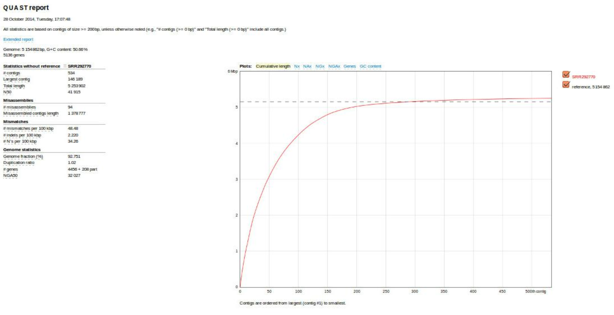

## Curso de Iniciación a la Secuenciación Masiva
BU-ISCIII

### Práctica 1 día 5: Whole genome analysis

17-21 Junio 2019, 7a Edición, Programa Formación Continua, ISCIII


#### Descripción
Este tutorial está parcialmente basado en el material suplementario al artículo [1]. Primero crearemos un ensamblaje del genoma E. coli O14:H4, comprobaremos su calidad. Adicionalmente haremos un MLST e identificaremos los genes de resistencia.

Se utilizarán los datos de secuenciación de Escherichia coli O104:H4, responsable del brote letal del síndrome urémico hemolítico (HUS) en Alemania en 2011 [2, 3]. La cepa que ocasión el brote pertenece al linaje E. coli enteroagregativa (EAEC), que ha adquirido una toxina Shiga [4], normalmente asociada con E. coli enterohemorragica (EHEC) y con múltiples genes de resistencia.

#### Ejercicio 1

```bash
# Nos movemos a la carpeta de los datos
cd cursoNGS/dia5/handson_dia5_bact
```

El objetivo de este ejercicio es poner en práctica los conocimientos adquiridos en este curso sobre el preprocesamiento de datos NGS para comprobar la calidad de las lecturas sobre las que vamos a trabajar. Para ello vamos a utilizar la herramienta FastQC. Puedes obtener más información sobre la aplicación en http://www.bioinformatics.babraham.ac.uk/projects/fastqc/

Desde la línea de comandos ejecutamos:

```bash
# Realizamos el análisis de calidad
fastqc -t 4 data/SRR292770_*
```

Vemos todos los reports abriendo los archivos .html (SRR292770_1.fastqc.html y SRR292770_2.fastqc.html)

Comprueba como las secuencias superan la mayoría de los test. El nivel de duplicación es ligeramente alto (en torno al 26 %).

#### Ejercicio 2

El objetivo de este ejercicio es realizar un ensamblaje de las lecturas mediante la aplicación SPAdes.

```bash
#Ejecutamos spades
spades.py -k 21 -t 2 --pe1-1 data/SRR292770_1.fastq.gz --pe1-2 data/SRR292770_2.fastq.gz -o spades_output

#Copiamos el fichero de contigs a nuestro directorio de trabajo
cp spades_output/contigs.fasta SRR292770_unordered.fasta
```

Al ejecutar este comando se generaran una serie de ficheros, incluido el fichero que contiene los contigs (contigs.fa). Copiamos el archivo contigs.fa y lo renombramos.

#### Ejercicio 3

Una vez que tenemos los contigs con las lecturas ensambladas es útil ordenarlos frente a un genoma de referencia. Una manera sencilla de conseguirlo es utilizando la opción Move Contigs de Mauve (http://asap.ahabs.wisc.edu/mauve).

Utilizaremos los contigs obtenidos anteriormente y la referencia E. coli Ec55989 (NCBI accession NC 011748 ) que corresponde con una cepa muy cercana con un genoma completo disponible, localizado en la carpeta /reference.

Se abre la aplicación desde la terminal:

```bash
#Ejecuta Mauve
mauve
```

En el menú elegimos la opción Tools -> Move Contigs.

Aparece una ventana de diálogo etiquetada Choose location to keep output files and folders. Navega hasta la carpeta donde estén la referencia y los contigs y crea una nueva carpeta denominada Mauve-Output.

Se muestra un mensaje acerca del proceso iterativo de reordenamiento de los contigs. Pulsa OK para continuar.

Aparece una caja de dialogo etiquetada como Align and Reorder Contigs.  Pulsa el boton Add Se-quence... y elige el genoma de referencia frente al que quieres alinear que en este caso es NC 011748.fna.

Pulsa el boton Add Sequence... nuevamente y elige el fichero con los contigs SRR292770_unordered.fasta

Pulsa Start para comenzar la reordenación. Este proceso puede llevar un tiempo. La reordenación se lleva a cabo mediante una serie de iteraciones. Por cada una de ellas se genera una ventana Mauve unknown - alignmentX, donde X es el número de iteración.

El conjunto final de contigs ordenado y orientado se encuentra en el fichero fasta de la última iteración. Para localizarlo mira dentro del directorio MauveOutput creado anteriormente. Por cada iteración debe haber una carpeta alignmentX. Copia el fichero SRR292779_unordered.fasta del directorio que tenga

el valor de X más alto a tu directorio de trabajo; nombrándolo como SRR292770.fasta. Una vez que hayas copiado el fichero puedes eliminar los directorios alignmentX.

#### Ejercicio 4

objetivo de este ejercicio es visualizar los contigs ordenados utilizando Mauve.  Generaremos un alineamiento múltiple de los contigs ordenados del genoma del brote O104:H4, la referencia Ec55989 y un ensamblaje adicional creado utilizando más lecturas que nuestro draft.

El ensamblaje alternativo de la cepa TY-2482 (NCBI accession AFVR01 ) está disponible para descargar en http://www.ncbi.nlm.nih.gov/Traces/wgs/?val=AFVR01. Deber amos descargarnos dicho ensamblaje y ordenarlo a la referencia Ec55989 siguiendo el método detallado en el ejercicio anterior. Como este paso

consume mucho tiempo; con los restantes ficheros de la practica encontrareis el fichero AFVR01 sorted.fasta que puede ser utilizado directamente.

* Ejecuta Mauve

* Elige la opcion de menu File -> Align with progressive Mauve...

* Aparece una caja de dialogo etiquetada como Sequences to align. Pulsa el boton Add Sequence... y elige el fichero de contigs SRR292770.fasta

* Pulsa Add Sequence... nuevamente y elige el fichero AFVR01.1_sorted.fasta con el ensamblaje alternativo. Pulsa Add Sequence... y añade el fichero reference/NC 011749.fna con el genoma de referencia Ec55989.
Especifica Multiple como nombre para el fichero de salida y pulsa Save.

* Pulsa Align... para ejecutar el alineamiento. Este proceso puede llevar un tiempo.

* Cuando el alineamiento finaliza puedes simplificar la imagen resultante si demarcas la opción View -> Style -> LCB connecting lines.

* Los bloques de colores indican las regiones de secuencia con homología en otros genomas. Las líneas rojas indican los bordes de los contig.

* Comprueba que el orden de los contigs de nuestro ensamblaje con SPAdes y el ensamblaje alternativo es similar. Ambos ensamblajes contienen contig que no mapan al genoma de referencia.

* Puedes almacenar una imagen de lo que estas visualizando con Tools -> Export -> Export image...

#### Ejercicio 5

El objetivo de este ejercicio es analizar la calidad de un ensamblado. Para ello vamos a utilizar la herramienta QUAST (http://bioinf.spbau.ru/quast).

```bash
#Ejecutamos QUAST
quast.py data/SRR292770_unordered.fasta -o quast \
-R data/help/NC_011748.fna -G data/help/NC_011748.gff \
-m 200 -t 2
```

Especificando con el parámetro -o el directorio donde se almacenarán los resultados. Con las opciones -R y -G le especificamos un genoma de referencia muy cercano a la cepa secuenciada y el modelo de genes correspondiente. De este modo, Quast es capaz de calcular algunas métricas adicionales.

Una vez Quast haya finalizado la ejecución podemos visualizar los resultados abriendo el	 fichero report.html.

Situándote encima de las etiquetas se muestra una breve descripción sobre la métrica correspondiente.

Trata de comprender de comprender cada una de las métricas y gráficos generados; y como te ayudan a determinar la calidad del ensamblado.



#### Ejercicio 6

El objetivo de este ejercicio es realizar tipado (typing) MLST e identificación de genes de resistencia utilizando datos de secuenciación masiva. Para ello se utiliza la herramienta SRST2 (http://katholt.github.io/srst2 ).

Para hacer el MLST debemos descargarnos la BD correspondiente y luego cotejar las lecturas frente a esa base de datos:

```bash
#Creamos un directorio para MLST
mkdir ecoli_mlst

#Nos movemos a ese directorio
cd ecoli_mlst

#Creamos un enlace (shortcut) a las lectuas
ln -s ../data/SRR292770_1.fastq
ln -s ../data/SRR292770_2.fastq

#Listamos el directorio (vemos los shortcuts)
ls -lh

#Bajamos la BD
getmlst.py --species "Escherichia coli#1"

#MLST
srst2 --input_pe SRR292770_1.fastq.gz SRR292770_2.fastq.gz \
--output ecoli_mlst --log --mlst_db ../data/help/MLST/Escherichia_coli#1.fasta \
--mlst_definitions ../data/help/MLST/ecoli.txt

#Visualizamos los resultados
less ecoli_mlst__mlst__Escherichia_coli#1__results.txt
```

SRST2 ya incorpora en su instalación una BD de genes de resistencia y, por tanto, no es necesario descargarse una:

```bash
# Volvemos al directorio anterior
cd ..

#Creamos un directorio para la resistencia
mkdir ecoli_resist

#Nos movemos a ese directorio
cd ecoli_resist

#Creamos un shortcut a las lectuas
ln -s ../data/SRR292770_1.fastq.gz
ln -s ../data/SRR292770_2.fastq.gz

#Identificacion de genes de resistencia
srst2 --input_pe SRR292770_1.fastq.gz SRR292770_2.fastq.gz \
--output ecoli_resis --log --gene_db ../data/help/quast/ARGannot.r1.fasta

#Visualizamos los resultados
less ecoli_resis__genes__ARGannot.r1__results.txt
```

#### Referencias

[1] David J. Edwards, Kathryn E. Holt: Beginner's guide to comparative bacterial genome analysis using next- generation sequence data. BMC Microbial Informatics, 2013.

[2] Buchholz U, Bernard H, Werber D, Bohmer MM, Remschmidt C, Wilking H, Delere Y, an der Heiden M, Adlhoch C, Dreesman J, et al: German outbreak of Escherichia coli O104:H4 associated with sprouts. N Engl J Med 2011, 365:1763{1770.

[3] Bielaszewska M, Mellmann A, Zhang W, Kock R, Fruth A, Bauwens A, Peters G, Karch H: Charac-terisation of the Escherichia coli strain associated with an outbreak of haemolytic uraemic syndrome in Germany, 2011: a microbiological study. Lancet Infect Dis 2011, 11:671{676.

[4] Frank C,Werber D, Cramer JP, Askar M, Faber M, an der Heiden M, Bernard H, Fruth A, Prager R, Spode A, et al: Epidemic pro le of Shiga-toxin-producing Escherichia coli O104:H4 outbreak in Germany. N Engl J Med 2011, 365:1771{1780.

[5] Zerbino, D. R., Using the Velvet de novo assembler for short-read sequencing technologies. Current protocols in bioinformatics / editoral board, Andreas D. Baxevanis ... [et al.], 2010. 10.1002/0471250953.bi1105s31
