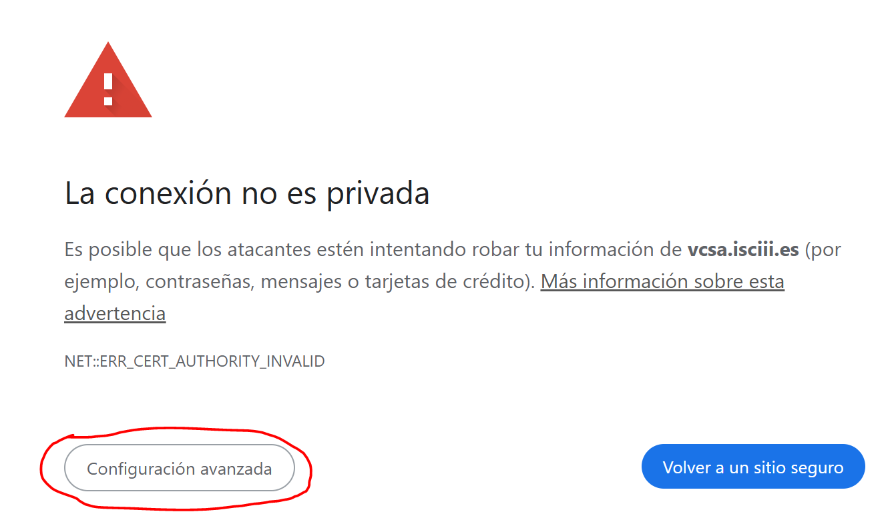
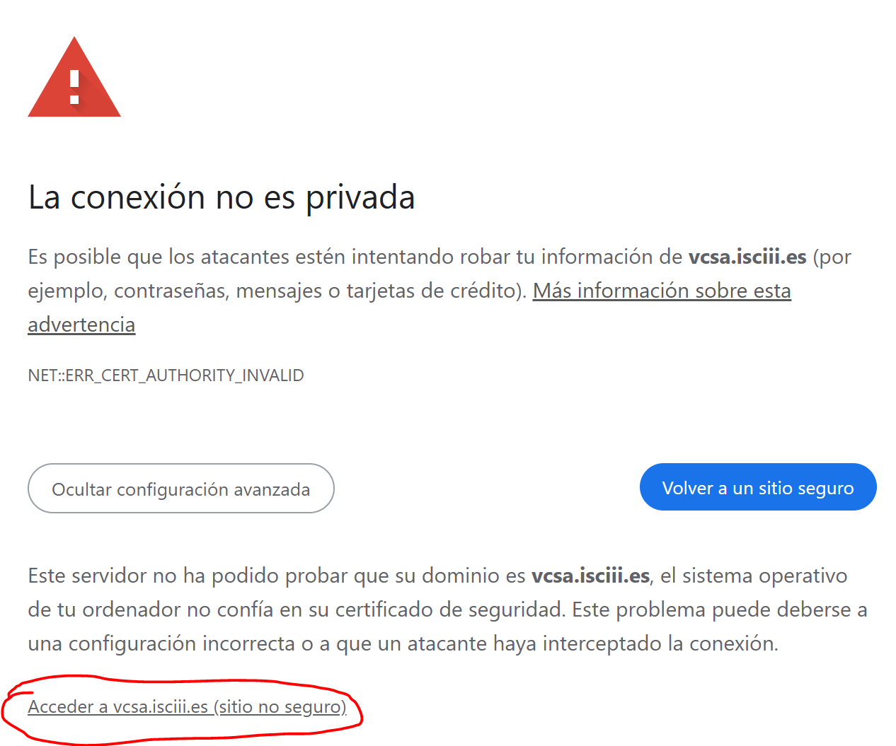
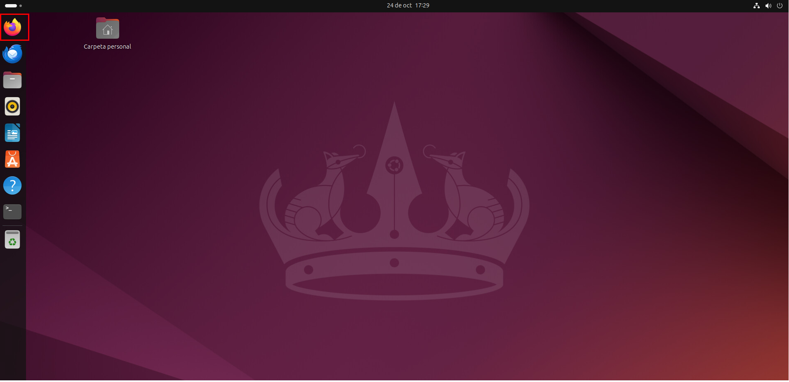
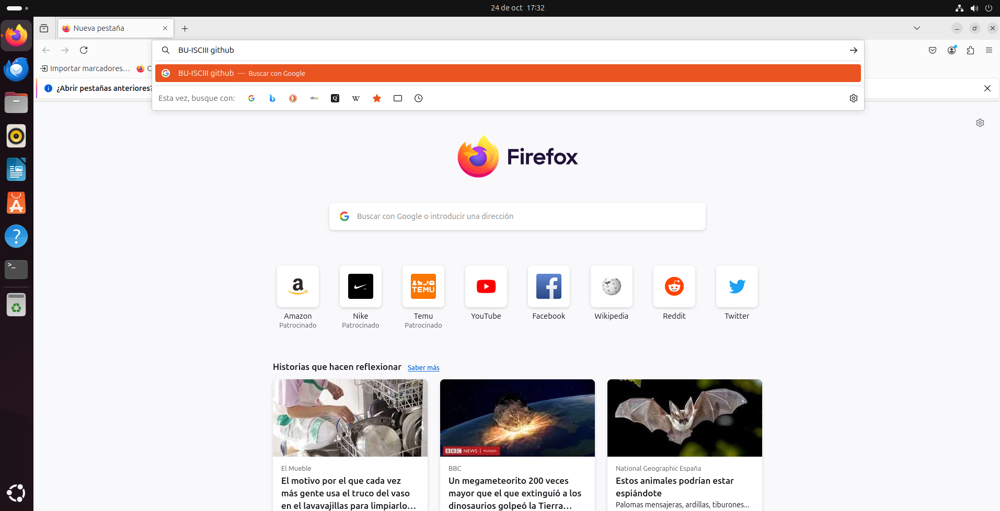
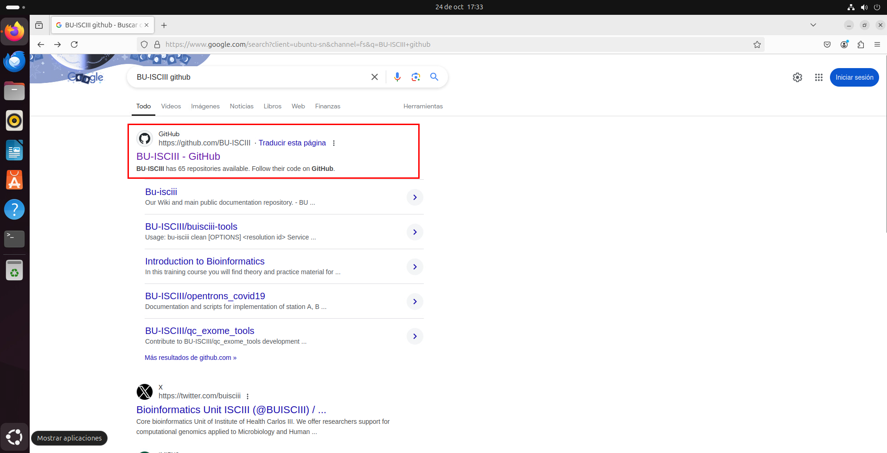
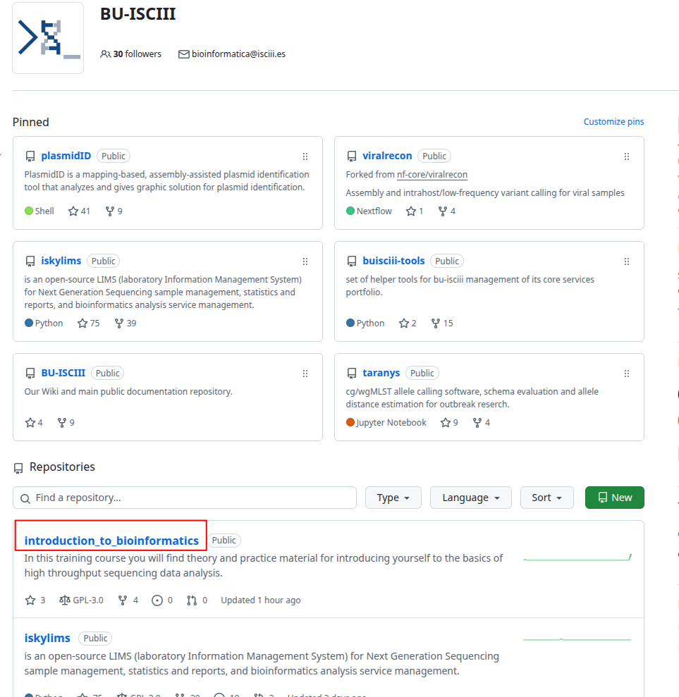
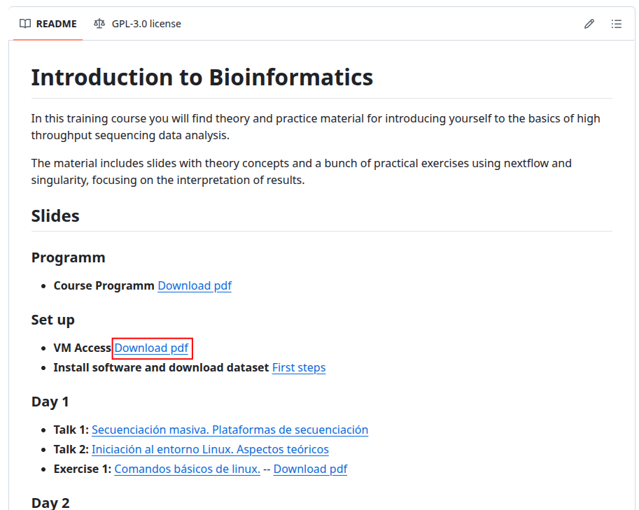

# Introduction to Bioinformatics : VM Access

FOLLOW THESE STEPS

In your computer:

- Open in your internet browser this URL: [https://vcsa.isciii.es/](https://vcsa.isciii.es/).
- Configuración avanzada > Acceder a vcsa.isciii.es (sitio no seguro)


- Go to `Iniciar VSPHERE CLIENT (HTML5)`
- Then type your ISCIII e-mail and password.
- Select your working machine (e.g. bioinfo01) in the left pannel
- Click on `INICIAR REMOTE CONSOLE`

In the remote console:

- Now click on your user: alumno, and type the password we will tell you.
- There, open a firefox window and open this tutorial again by:
  - Google: BU-ISCIII github
  - Select `introduction_to_bioinformatics`
  - Exercise0.







Now you are here again!

Open a new terminal (ctrl+alt+t) and navigate to your home directory if you are not already there:

```bash
pwd
cd
pwd
#Output: /home/alumno
```
